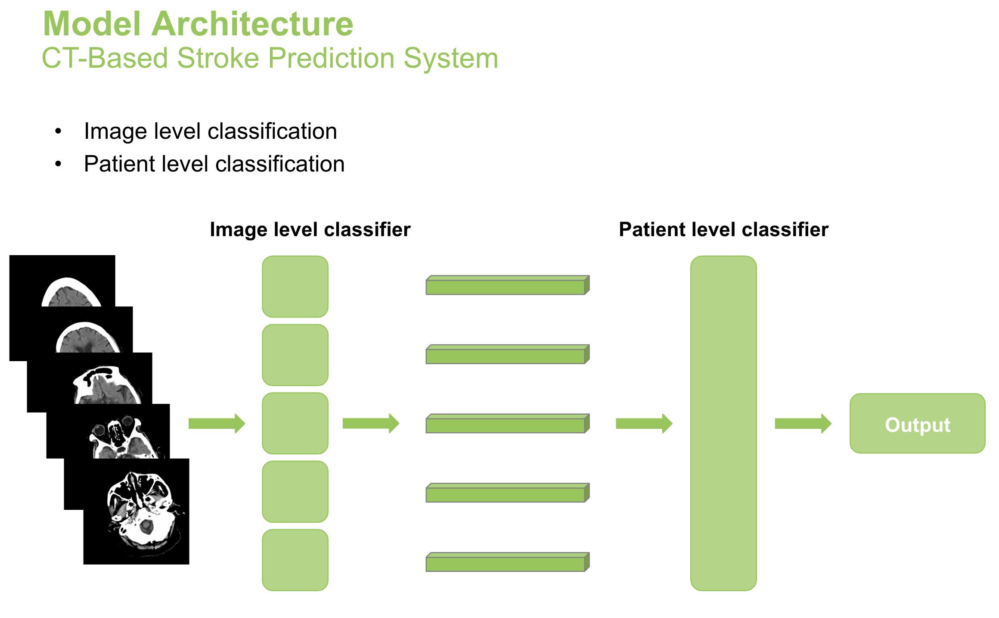
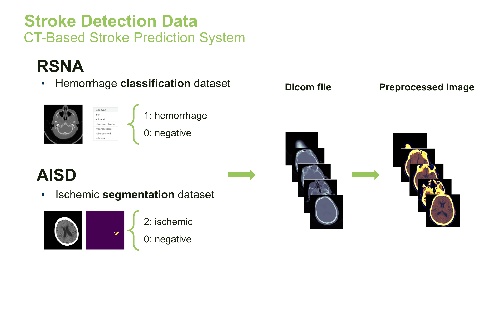
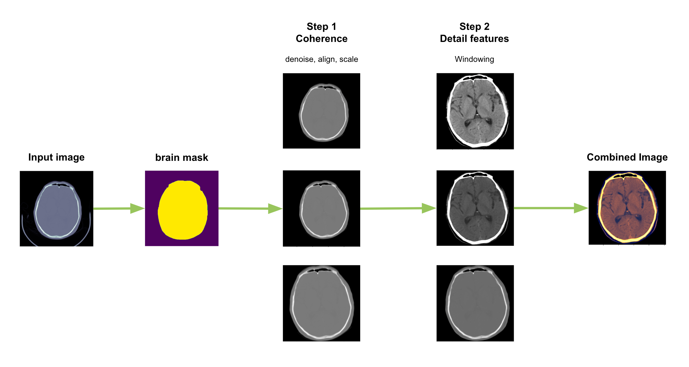
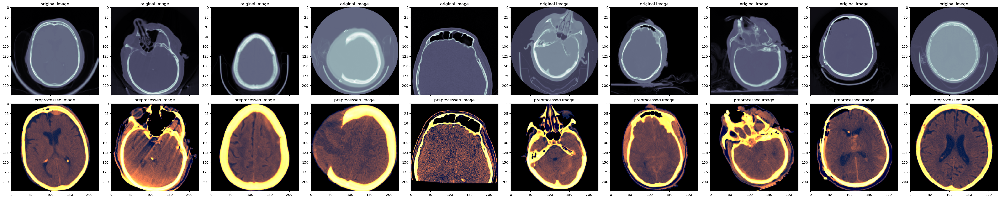
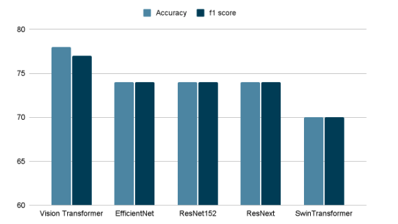
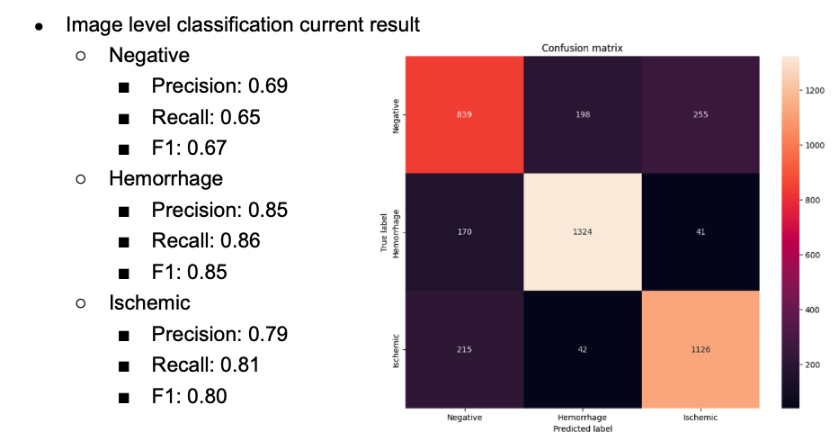
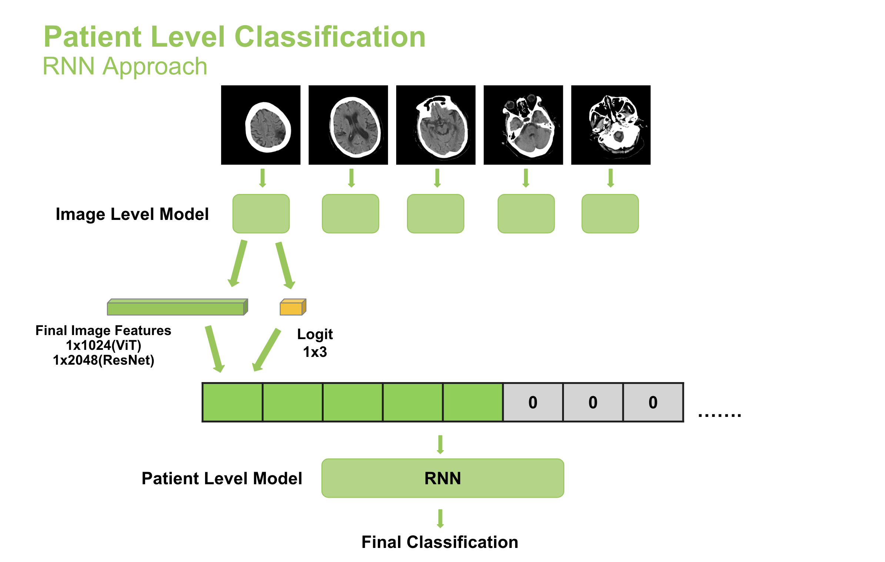
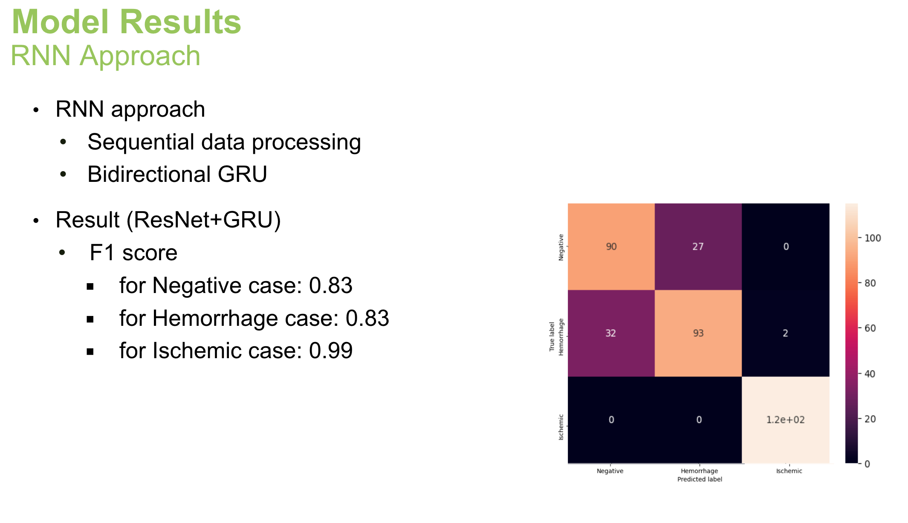
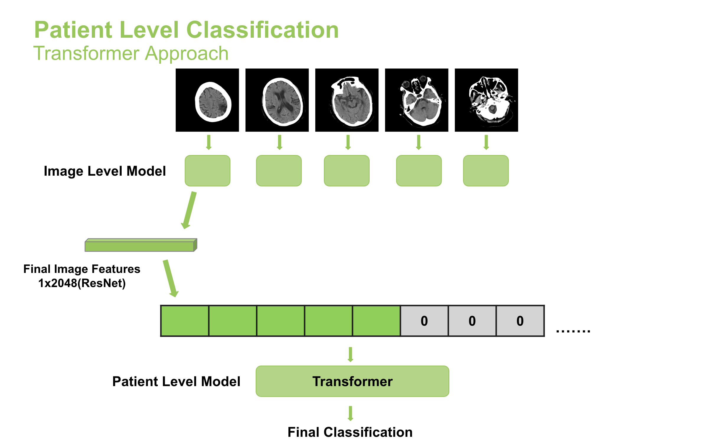
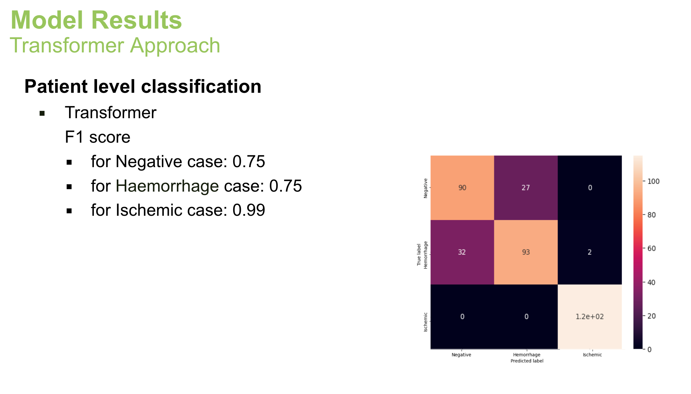

[](https://opensource.org/licenses/MIT)

# Stroke Classifier Model Implementation

This repository contains the code implementation for the Stroke Type Classifier model. The model's purpose is to accurately classify stroke types using medical imaging data, particularly CT scans. Precise stroke classification is crucial for prompt and efficient medical responses. The model architecture follows a two-step process: initially, an image-level classifier extracts features from individual CT scans, and subsequently, the sequence of these features is fed into a patient-level classifier for the final output.



## Table of Contents

- [Introduction](#introduction)
- [Repository Structure](#repository-structure)
- [Data and Data Preprocessing](#data)
- [Model](#model)
- [License](#license)
- [Contact](#contact)

## <a name="introduction"></a>Introduction

AI model designed for acute stroke detection to assist medical professionals in diagnosing strokes in patients, offering valuable support for implementation in a Mobile Stroke Unit.

## <a name="repository-structure"></a>Repository Structure

- `data_preprocessing/`: Code for data preprocessing and augmentation.
	- 'image_to_patient.py': build patient-wise dataset
	- 'balance_data.ipynb': balance the data volume to handle data imbalance
	- 'data_preprocess.py': functions for data preprocessing
	- 'data_pipeline.py': run data preprocessing and augmentation
	- 'compute_image_feature.py': compute multi-layer images into features with fine-tuned image-level model
	
- `model/`: Implementation of the stroke type classifier model architecture.
	- 'patient_classifier_transformer.py': patient-wise stroke type classifier model implementation - Transformer Architecture
   	- 'model_selection.ipynb': model selection scripts - hyperparameter optimization for transformer model
	- 'img_model_hparam.py': Hyperparameter tuning for image level classifier
	- 'GRU_hparam.ipynb': Hyperparameter tuning for GRU model for patient level classifier
	- 'train_img_classification.py': Script for training image level classifier model
	- 'train_patient_classification.py': Script for training patient level classifier model(RNN based model)
	- The file structure of this repo is only partial due to data size. Below is an example version of original structure.
	```
	Model/
	│   ├── train_img_classification.py
	│   ├── train_patient_classification.py
	│   ├── img_model_hparam.py
	│   ├── GRU_hparam.ipynb
	│   ├── model_selection.ipynb
	│   ├── patient_classifier_transformer.py
	│   ├── data/
	│   │   ├── 14k_preprocessed_excl_scale/
	│   │   │   ├── X.pickle
	│   │   │   ├── y.pickle
	│   │   ├── 14k_preprocessed/
	│   │   │   ├── X.pickle
	│   │   │   ├── y.pickle
	│   │   ├── patientwise/
	│   │   │   ├── patient_data_combine.pickle
 	│   ├── imagewise_models/
	│   │   ├── 14k_excl_scale/
 	|   │   │   ├── vit_l_16.ckpt
 	│   │   ├── full_preprocess_14k/
 	|   │   │   ├── vit_l_16.ckpt
 	|   │   │   ├── ...
  	│   ├── imagewise_models_state_dict/
	│   │   ├── 14k_excl_scale/
 	|   │   │   ├── vit_l_16.ckpt
 	│   │   ├── full_preprocess_14k/
 	|   │   │   ├── vit_l_16.ckpt
 	|   │   │   ├── ...
  	│   ├── patientwise_models/
	│   │   ├── resnet152_rnn.ckpt
 	│   │   ├── vit_l_16_rnn.ckpt
 	│   ├── patientwise_models_state_dict/
	│   │   ├── resnet152_rnn.ckpt
 	│   │   ├── vit_l_16_rnn.ckpt
 	...
	```


- `requirements.txt`: List of required Python libraries.
- `LICENSE`: Information about the open-source license.
- `README.md`: The document you are currently reading.

## <a name="data"></a>Data and Data Preprocessing

It uses the RSNA and AISD dataset to gain various types of stroke brain CT scans including negative, hemorrhage, and ischemic.
You'll first have to download the datasets in order to run the notebooks. Additional labelling to the dataset is required as both dataset are for different purpose - hemorrhage type classification and ischemic area segmentation.



### Download Links

RSNA(Hemorrhage & Negative): https://www.kaggle.com/competitions/rsna-intracranial-hemorrhage-detection/overview
AISD(Ischemic): https://github.com/GriffinLiang/AISD

### Data Preprocessing

Data Preprocessing to gain more consistent input for the model despite of different sources of the brain CT scans.



### Data Result



## <a name="model"></a>Model

We implemented image-level classifier and patient-level classifier.

- Image-level Classifier: Classify stroke type of a single brain CT scan.
- Patient-level Classifier: Classify the stroke type for an individual patient by analyzing a sequence of brain CT scans belonging to that patient.

### Image-level Classifier
We have implemented an image-level classifier using transfer learning. We extensively explored various families of models, and below are the results of the better performing models, along with a detailed analysis of the best performing model, which is the ViT-L-16.



### Patient-level Classifier

We implemented patient-level stroke classifier in two different approaches - RNN and Transformer.

### RNN



- Vit-Rnn model also showed almost identical result
### Transformer




## <a name="license"></a>License
Distributed under the MIT License.

## <a name="contact"></a>Contact

[Eunmi Joo's Github](https://github.com/eunmi228)

[Kiduk Kang's Github](https://github.com/kdkangg)
